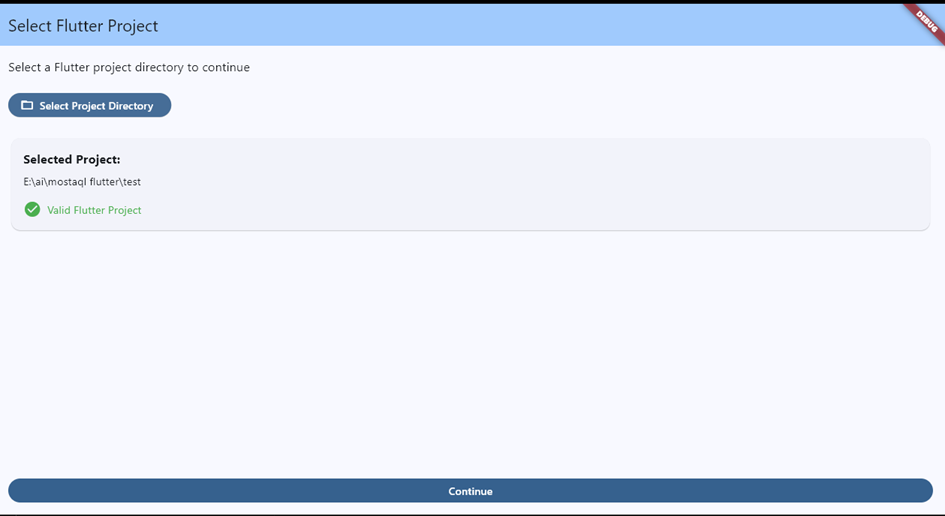
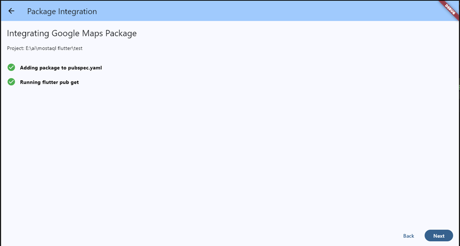
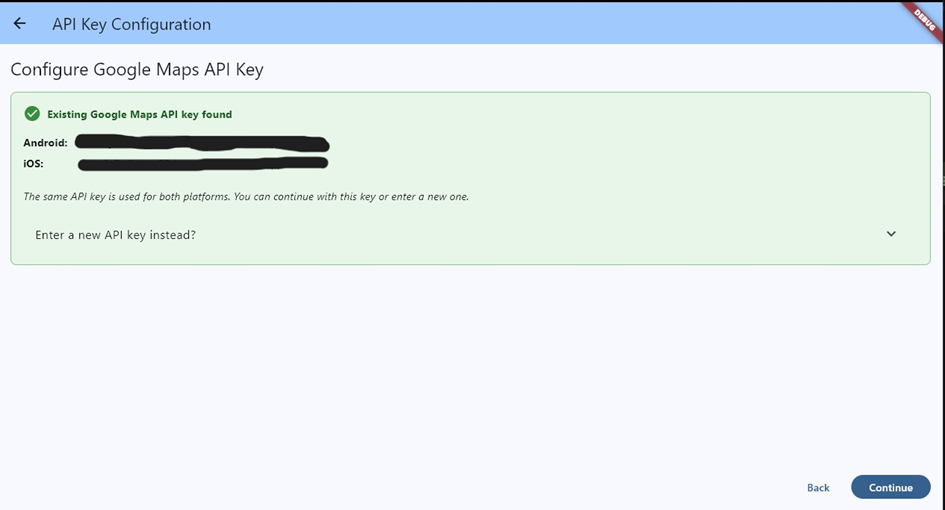
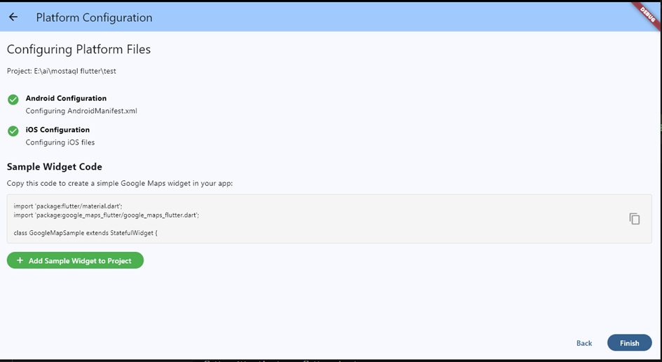

# Flutter Package Integrator

## Overview
This Flutter application automates the integration of the Google Maps package into Flutter projects. It provides a streamlined workflow for developers to quickly add and configure Google Maps in their applications.

## Screenshots

### Project Selection Screen

### Package Integration Screen

### API Key Configuration Screen

### Platform Configuration Screen

## Features

### 1. Project Selection
- Select your Flutter project directory
- Verification of valid Flutter project structure
- Detection of existing project configuration

### 2. Package Integration
- Automatic integration of the Google Maps Flutter package
- Dependency management with pubspec.yaml
- Automated pub get execution

### 3. API Key Management
- Easy API key configuration for Google Maps
- Detection of existing API keys in project files
- Support for different keys across platforms

### 4. Platform Configuration
- Android manifest configuration with required permissions
- iOS platform setup with Info.plist and AppDelegate modifications
- Detailed platform-specific configuration feedback

### 5. Sample Implementation
- Addition of a ready-to-use Google Maps sample widget
- Code integration with your existing project structure
- Basic implementation examples

## Demo Version Limitations

This GitHub repository contains only the UI components and structure of the application. The core implementation features are excluded from this public repository.

For the full version with complete functionality, please contact me directly to discuss licensing and access.

## Technical Details

- **State Management**: Riverpod
- **Architecture**: Feature-based organization with clean separation of concerns
- **Platform Support**: Windows, with expandability to other platforms

## Requirements

- Flutter SDK 3.0.0 or higher
- Dart 3.0.0 or higher
- Windows environment for the executable version

## Getting in Touch

For business inquiries, full version access, or custom development needs, please contact me at:

- Email: [azizbaffoun67@gmail.com](mailto:azizbaffoun67@gmail.com)
- GitHub: [Your GitHub Profile](https://github.com/yourusername)

---

© 2023 Your Name. All rights reserved.

